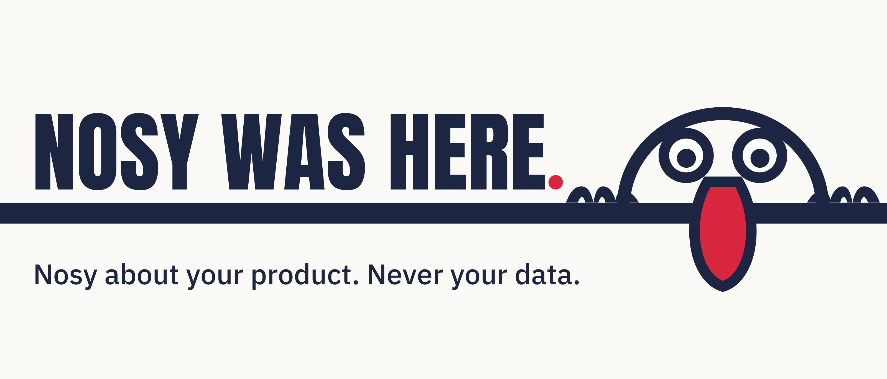
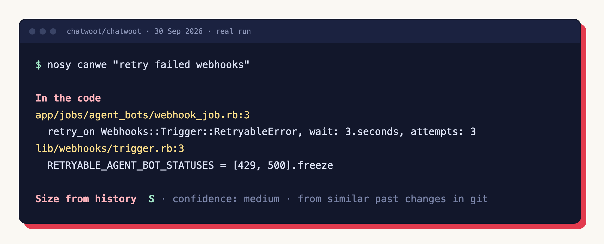
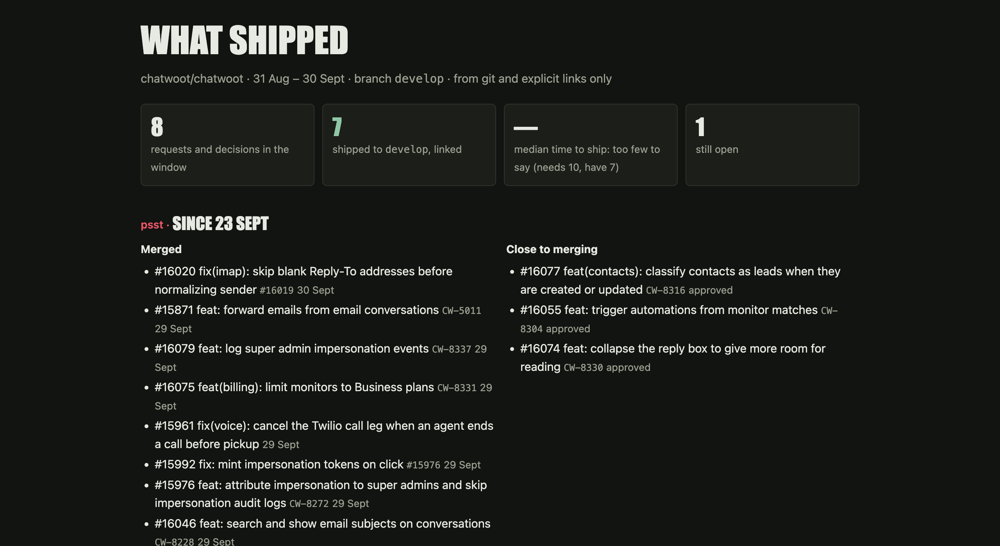

<p align="center"></p>

# 👀 Nosy

> Nosy about your product. Never your data.

<p align="center">
  <a href="https://github.com/nosy-hq/nosy/actions/workflows/test.yml"></a>
  
  
</p>

A product manager inside your coding agent. It goes through your backend, git history and roadmap first, then checks what your rivals shipped, and tells you what to build next: **sized, placed on the roadmap, with a receipt for every claim.**

Your agent reads today's code. Nosy keeps what a session can't: the record of what merged and why, demand counted from your issues, and last week's answers.

The plugin is free and MIT. Nosy Cloud (cloud.nosy.sh) is live and free for now: a shared record for your team. It never changes what the plugin does. [See a sample report](https://cloud.nosy.sh/demo) (made-up data).

<p align="center"></p>

<p align="center"><sub>A real run on <a href="https://github.com/chatwoot/chatwoot">chatwoot/chatwoot</a>, lines removed. Nosy hands your agent the evidence; the verdict is your agent's. <a href="docs/EXAMPLE.md">Full run, and what it got wrong</a>.</sub></p>

## Install

**Claude Code** (terminal or desktop app):

```
/plugin marketplace add nosy-hq/nosy
/plugin install nosy@nosy
```

Send the two commands one at a time. In the desktop app the second one opens the plugin page: click **Install plugin**. `claude plugin list` should show `nosy@nosy` enabled. Start a new session (or run `/reload-plugins`), open your repo and run `/nosy:move-in`. Every plugin command is namespaced with the plugin name, so it is `/nosy:<command>`; the top-level skill is `/nosy:nosy`.

**Codex, Cursor, Gemini CLI, Copilot, OpenCode, Kiro** don't know `/plugin`. In your project, run:

```
npx github:nosy-hq/nosy install
```

Or tell your agent: *"Read https://github.com/nosy-hq/nosy/blob/main/llms.txt and install Nosy in this repo."* Then type `/nosy` (Codex: `$nosy`). If your agent asks you to trust Nosy's hooks, there are four small ones, each with an off switch ([docs/INSTALL.md](docs/INSTALL.md)).

Needs git and Node 18.17 or newer. Run `move-in` once (`/nosy:move-in` from the plugin, `/nosy move-in` from a skill install): it reads your README, docs, decision files, git history and, through `gh` if you have it, issues and PRs. The counting runs on your machine with no model.

## Try these first

| Type | You get |
|---|---|
| `/nosy:nosy` | The 2–3 commands worth running in *this* repo, each with the reason. (Skill-only install: `/nosy`.) |
| `/nosy:peek` | What shipped, what didn't, what has no screen. |
| `/nosy:canwe "can we do X?"` | The code that already exists, the size from git history, and how often it was asked for. |
| `/nosy:psst` | What you could ship this week. Asked for + ready goes first. |

<p align="center"></p>

<p align="center"><sub>The page <code>nosy page --scoreboard</code> writes: what reached the branch, from git and explicit links only. Same repo, same day.</sub></p>

## Tested against a plain agent

`psst` ("what could we ship this week?") against the same agent without Nosy, same repo, same question, blind. Judged by models, run by us:

| Run | Nosy–plain (gradings) |
|---|---|
| 1 | **0–1**: plain won |
| 2 | **1–2**: plain won |
| 3 | **2–2**: a tie |
| 4 | **5–1**: Nosy won, after we fixed what the losses showed |

Precision in run 4: 16 of 16 items held for Nosy, 18 of 28 for plain. The fixes came after the losses, so these runs are not independent, and two of three questions are one private app. Method, limits and every loss: [docs/EVALS.md](docs/EVALS.md).

## Other agents

<details>
<summary>More ways: MCP, GitHub Actions, Slack, terminal, Windsurf, Roo, Junie</summary>

Nosy is one skill folder (`skill/`, the open Agent Skills format) plus small dependency-free Node scripts.

| Where | How |
|---|---|
| **Claude Code** (default) | `/plugin marketplace add nosy-hq/nosy` then `/plugin install nosy@nosy` |
| **Any coding agent, one command** | In your project: `npx github:nosy-hq/nosy install`. It finds which of Claude Code, Codex, Cursor, Gemini CLI, Copilot, OpenCode and Kiro your project uses and copies the skill into each one's folder. `nosy update` and `nosy uninstall` touch only what it wrote. Then type `/nosy` (Codex: `$nosy`). |
| **Windsurf, Roo, Junie…** | Copy the skill folder: `npx skills add nosy-hq/nosy`, or by hand into the agent's skills folder. Then ask "Nosy, psst" or `/nosy psst`. |
| **Any MCP client** (Claude Desktop, Cursor, Zed, VS Code…) | `npx github:nosy-hq/nosy mcp` as a stdio server |
| **GitHub Actions** (weekly, no model key) | `uses: nosy-hq/nosy@main`, see [`docs/examples/nosy-weekly.yml`](docs/examples/nosy-weekly.yml) |
| **Slack / Discord** | The Action, or `nosy notify`, posts the weekly "Psst…" to a webhook. |
| **Terminal, no agent** | `npx github:nosy-hq/nosy weekly` |

`npx github:…` runs code straight from a repo. To know which code, pin a release tag: `npx github:nosy-hq/nosy#v0.16.0 install`. Every path in detail: [docs/INSTALL.md](docs/INSTALL.md).

</details>

## Commands

<details>
<summary>All 17 commands</summary>

| Command | What it does |
|---|---|
| `/nosy:nosy` | Suggests the 2–3 commands worth running now. (Skill-only install: `/nosy`.) |
| `/nosy:move-in` | Learns your product, rules and roadmap. Run once. |
| `/nosy:shipped` | What reached your integration branch, and which decision each change was for. |
| `/nosy:peek` | What shipped, what didn’t, what has no screen. |
| `/nosy:psst` | What you could ship today. Asked for + ready goes first. |
| `/nosy:canwe <question>` | “Can we do X?” Answered with a size; remembered next week. |
| `/nosy:neighbors` | What rivals shipped, and how much of it you already have. |
| `/nosy:overheard [hours]` | Which open PRs and issues serve which decision. |
| `/nosy:spill <topic>` | A spec your agents can build from. Stays local. |
| `/nosy:scoop` | The roadmap, in waves. |
| `/nosy:tea` | One shareable decision page. |
| `/nosy:map` | What your product is made of: apps, screens, what’s off. |
| `/nosy:dresscode` | Your design system, checked in 20 areas, with a receipt for each. |
| `/nosy:frontyard` | Is your landing page behind the product, or ahead of it? |
| `/nosy:stakeout` | The whole weekly loop, ending with what changed. |
| `/nosy:bet · /nosy:score` | Optional: record a bet, settle it against git later. |
| `/nosy:doctor` | Renames old files and keys in a `pm/` written by an older Nosy (`--fix`). |

Most commands have a terminal twin that runs with no model, for example `npx github:nosy-hq/nosy peek` (see [docs/CLI-CONTRACT.md](docs/CLI-CONTRACT.md) for which, and for the ones that are agent only). `npx github:nosy-hq/nosy rival-demand` has no slash command: it lists what the users of your open-source rivals ask for most, from their public issues and Discussions.

</details>

**1 skill · 17 commands · 81 scripts · 4 hooks · 16 named rules.** Plain, dependency-free Node: the counting runs in your terminal, in CI or as an MCP server, with no model and no API key. Your agent adds the judgment. Everything Nosy remembers lives in a `pm/` folder in your repo.

## If it broke

- **Install looks broken:** `npx github:nosy-hq/nosy doctor --check` checks Node, git, gh, the skill files and hooks, and prints the fix next to each failing line. Local, no network, writes nothing.
- **Still stuck:** open your agent in this repo and say: *"Read AGENTS.md and docs/INSTALL.md, install Nosy for me."*
- **Uninstall:** `/plugin uninstall nosy@nosy` (other agents: `npx github:nosy-hq/nosy uninstall`). Your `pm/` folder stays; it's yours.

## What Nosy reads, what leaves your machine

- **Reads.** Nosy reads your code, git history, GitHub issues and PRs including their text (titles, bodies, comments and author logins, through your own `gh`), your decision and roadmap docs, and public web pages.
- **Writes.** Nosy writes to your `pm/` folder, plus a few named files: temporary files, a first-run marker, the skill folders `nosy install` copies and files you name with a flag. The optional weekly GitHub Action commits and pushes `pm/state/` and the decision page only if you set `commit: "true"`.
- **Sends.** Nothing of yours leaves on its own. Nosy's network calls are reads: the public rival pages you listed, and GitHub through your own `gh`, including a read-only lookup of the `#N` issues your agent's answer cites (`NOSY_CITE_GH=0` turns that off), and, when you run `nosy rival-demand`, the public issues and Discussions of the open-source rivals you name. `nosy notify` and `nosy publish` send something only when you run them, and `publish` is off until you configure a target and confirm (counts and structure, never quotes). Both stop on a secret or personal data unless you pass `--allow-sensitive`. The model call is your agent's.
- **No telemetry.** No analytics, usage pings, crash reports or update checks.

The exact list, and what masking does not cover: [docs/DATA.md](docs/DATA.md).

## When to skip it

| Skip Nosy if… | Why |
|---|---|
| You want a **code reviewer** | No comments on style, bugs or code quality. Ever. |
| You want a **competitor tracker** | Rivals are one input, checked second. It isn't an alert service. |
| The project has **no git history**, or is brand new | Little to count. Shipped rates on fewer than 10 rows read "too few to say". |
| You only have **claude.ai chat** | No repo access there, so the scripts don't run ([details](docs/INSTALL.md#e-claudeai-chat-zip-upload)). |
| You want it to **decide or act for you** | It suggests. It never edits your page, pushes, or opens issues unless you ask. |

## Status

Early version, open source (MIT). No stability promise yet. Questions and bugs: [issues](https://github.com/nosy-hq/nosy/issues). Also: [CHANGELOG](CHANGELOG.md), [SECURITY](SECURITY.md), [CONTRIBUTING](CONTRIBUTING.md).
